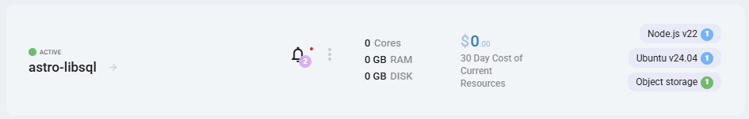

Nasazení perzistentní databáze pomocí [libsql-server](https://github.com/tursodatabase/libsql/blob/main/libsql-server/README.md) spolu s projektem [Astro](https://astro.build), který využívá [@astrojs/db](https://docs.astro.build/en/guides/astro-db/) na [Zerops](https://zerops.io), je překvapivě jednoduché. V tomto článku si ukážeme, jak při nasazení postupovat.

**Předpoklady pro tento návod:**

- Předchozí znalost [Astro](https://astro.build) a [@astrojs/db](https://docs.astro.build/en/guides/astro-db/).
- Základní povědomí o Zeropsu. Více se dozvíte na [zerops.io](https://zerops.io).
- CLI nástroj s názvem [zcli](https://docs.zerops.io/references/cli). Pokud jste jej si ještě nenainstalovali, nainstalujte a nastavte jej podle [oficiální dokumentace](https://docs.zerops.io/references/cli).
- Vlastní projekt Astro s adaptérem [@astrojs/node](https://docs.astro.build/en/guides/integrations-guide/node/).

Pokud ještě nemáte vlastní projekt Astro, můžete si naklonovat [příkladný repozitář na GitHubu](https://github.com/dallyh/astro-libsql-zerops-example).

## Nastavení prostředí Zerops

Aby váš projekt na Zerops fungoval, budete potřebovat tři klíčové služby:

1. **Node.js službu** pro Astro frontend
2. **Object-storage službu** pro perzistenci databáze
3. **Ubuntu službu** pro spuštění `libsql-server`

### Vytvoření projektu a služeb na Zerops

[Projekt Zerops](https://docs.zerops.io/features/infrastructure#project) je ve své podstatě kontejner vzájemně propojených služeb, který obsahuje všechny vaše ručně definované služby a také _core_ službu projektu (spravovanou Zerops), která zajišťuje vzájemnou komunikaci mezi službami projektu, zpracovává logy atd.

Můžete buď vytvořit projekt Zerops manuálně, nebo použít předdefinovanou YAML konfiguraci. Pro efektivitu a jednoduchost budeme používat soubor `zerops-project-import.yml` v kořenovém adresáři našeho Astro projektu.

Tento YAML soubor definuje projekt a potřebné služby, což zajišťuje vždy stejnou konfiguraci prostředí. Podrobný rozpis formátu souboru najdete v [dokumentaci Zerops](https://docs.zerops.io/references/import).

```yaml
<!--zerops-project-import.yml-->
project:
    name: astro-libsql
    corePackage: LIGHT
services:
    # Služba založená na Ubuntu
    - hostname: libsqld
      type: ubuntu@24.04
    # Node.js služba
    - hostname: frontend
      type: nodejs@22
    # Object-storage služba
    - hostname: dbstorage
      type: object-storage
      objectStorageSize: 2
```

Pro import projektu do Zerops spusťte následující příkaz v kořenovém adresáři Astro projektu.

```sh
zcli project project-import ./zerops-project-import.yml
```

Po spuštění by výstup měl vypadat následovně:

```
➤  INFO  Import yaml found: C:\Repos\astro-libsql-zerops-example\zerops-project-import.yml
➤  INFO  Yaml file was checked
➤  INFO  Number of services to be added: 3
➤  INFO  Queued processes: 3
✔  DONE  dbstorage: stack.create
✔  DONE  frontend: stack.create
✔  DONE  libsqld: stack.create
➤  INFO  project imported
```

Úspěšné vytvoření projektu a všech služeb si můžete ověřit také na dashboardu Zerops. Služby `libsqld` a `frontend` by měly být vytvořeny jako prázdné a čekat na nasazení. Služba `dbstorage` by měla být připravena k použití.



## Konfigurace a nasazení služeb

Dále je potřeba nakonfigurovat a nasadit služby `libsqld` a `frontend`. Služba `dbstorage` nevyžaduje další nastavení, jelikož se jedná pouze o instanci object storage.

### Nastavení služeb pomocí souboru zerops.yml

Soubor `zerops.yml` určuje, jak mají být naše služby sestaveny a spuštěny. Tento soubor by měl být vytvořen v kořenovém adresáři Astro projektu. Specifikaci formátu najdete v [dokumentaci Zerops](https://docs.zerops.io/zerops-yml/specification).

Soubor obsahuje nastavení služeb `libsqld` a `frontend` spolu s předdefinovanými proměnnými prostředí (environment variables), příkazy pro sestavení a spuštění. Pokud váš Astro projekt vyžaduje jiné příkazy pro sestavení nebo jiné soubory, které mají být nasazeny, upravte sekci služby `frontend` v následujícím příkladovém souboru.

```yaml
<!--zerops.yml-->
zerops:
    - setup: libsqld
      run:
          base: ubuntu@24.04
          envVariables:
              LIBSQL_BOTTOMLESS_ENDPOINT: ${dbstorage_apiUrl}
              LIBSQL_BOTTOMLESS_BUCKET: ${dbstorage_bucketName}
              LIBSQL_BOTTOMLESS_AWS_DEFAULT_REGION: eu-central-1
              LIBSQL_BOTTOMLESS_AWS_ACCESS_KEY_ID: ${dbstorage_accessKeyId}
              LIBSQL_BOTTOMLESS_AWS_SECRET_ACCESS_KEY: ${dbstorage_secretAccessKey}
          prepareCommands:
              - curl --proto '=https' --tlsv1.2 -LsSf https://github.com/tursodatabase/libsql/releases/download/libsql-server-v0.24.31/libsql-server-installer.sh | sh
              - mv /root/.cargo/bin/sqld /usr/local/bin/sqld
          start: sqld --enable-bottomless-replication --http-listen-addr 0.0.0.0:8080
          ports:
              - port: 8080
                httpSupport: true
    - setup: frontend
      build:
          base: nodejs@22
          envVariables:
              ASTRO_DB_REMOTE_URL: ${RUNTIME_ASTRO_DB_REMOTE_URL}
          buildCommands:
              - npm install
              - npm run build:remote
          cache:
              - node_modules
          deployFiles:
              - dist
              - node_modules
              - package.json
      run:
          base: nodejs@22
          ports:
              - port: 4321
                httpSupport: true
          envVariables:
              HOST: 0.0.0.0
              ASTRO_DB_REMOTE_URL: http://libsqld:8080
          start: npm run start
```

### Nasazení databázové služby

Databázová služba je nastavena na využití `dbstorage` object storage pro [bottomless](https://github.com/tursodatabase/libsql/tree/main/bottomless) replikaci. Tím je zajištěno, že databáze zůstane perzistentní i přes změny služby a opětovná nasazení. V souboru `zerops.yml` vidíte, že některé proměnné začínají předponou `LIBSQL_BOTTOMLESS-*`. Tyto proměnné odkazují na automaticky generované proměnné prostředí pro object storage službu `dbstorage`, které jsou přístupné uvnitř projektu Zerops.

`libsql-server` je nainstalován v runtime fázi služby spuštěním instalátoru `libsql-server`. Po dokončení instalace je nainstalovný daemon serveru `sqld` přesunut do finálního adresáře, odkud je možné jej přímo spustit.

Pro nasazení služby `libsqld` na Zerops spusťte:

```sh
zcli push
```

Vyberte projekt `astro-libsql` a poté službu `libsqld`.


Po úspěšném nasazení by měl být spuštěn serverový daemon a automaticky by se měla vytvořit databáze a začít její replikace. Replikace je aktivní, protože je povolena volbou `--enable-bottomless-replication`. Stav můžete ověřit v dashboardu Zerops pod logy běhu služby `libsqld`.

### Nahrání schématu databáze

Po nasazení služby `libsqld` musíme nahrát schéma databáze pomocí příkazu `push` který poskytuje `@astrojs/db`. Protože nahrávání schémat databáze ve fázi sestavovacího kroku služby nebo aplikace obecně není doporučeno z různých důvodů, měli bychom schéma databáze nahrát z lokálního počítače.

Nejdříve se proto musíme připojit k [VPN](https://docs.zerops.io/references/vpn) poskytované Zerops, abychom získali přístup k vzdálenému databázovému serveru. K VPN se připojíte pomocí `zcli vpn up`. Spusťte příkaz v terminálu a poté vyberte projekt `astro-libsql`. Pokud připojení selže, ujistěte se, zda jste správně nainstalovali [Wireguard](https://www.wireguard.com/), který je nutný pro navázání připojení do VPN.

:::caution
Před spuštěním příkazu se ujistěte, že mááte v projektu Astro nastavenou proměnnou `ASTRO_DB_REMOTE_URL`. Měla by být nastavena na adresu URL služby `libsqld`, která je v tomto případě `http://libsqld:8080`.
:::

Po připojení do VPN přeneste schéma databáze do vzdálené databáze:

```sh
npm run astro db push --remote
```

:::note[Spouštění příkazů přes Powershell]
Většina Astro projektů již má příkaz `astro` definován v souboru `package.json`. V [dokumentaci Astro DB](https://docs.astro.build/en/guides/astro-db/#pushing-table-schemas) je uvedeno, že příkaz `push` spouštíme pomocí `npm` následovně: `npm run astro db push --remote`. V prostředí Powershellu to nefunguje správně, jelikož příznak `--remote` je tiše ignorován. Pokud spouštíte příkazy ze souboru `package.json` pomocí Powershellu, měli byste je spouštět takto: `npm run astro db push -- --remote` Více informací najdete v článku [this](https://www.lloydatkinson.net/posts/2022/powershell-npm-scripts-and-silently-dropped-arguments/).
:::

#### Naplnění databáze

Někdy je třeba naplnit (seed) databázi počátečními daty, pokud začínáte s čistou databází. To lze provést spuštěním následujícího příkazu:

```sh
npm run astro db execute ./db/seed.ts --remote
```

Tento příkaz naplní databázi počátečními potřebnými daty spuštěním souboru `seed.ts`, který by měl obsahovat vámi definovaná data.

Pokud již máte databázi s nějakými daty a potřebujete ji migrovat, můžete to provést pomocí nástrojů jako [Beekeeper Studio](https://www.beekeeperstudio.io/features/import-export). K databázi máte přístup, dokud jste připojeni k VPN. Můžete se k ní připojit jako k jakékoli jiné databázi.

### Nasazení frontendu

Pro nasazení Astro projektu spusťte:

```sh
zcli push
```

Vyberte projekt `astro-libsql`, poté službu `frontend`. Jakmile bude nasazeno, bude webová stránka dostupná na adrese `http://frontend:4321` (za předpokladu, že jste stále připojeni k VPN a váš Astro projekt používá výchozí port). Stav služby lze opět ověřit v dashboardu Zerops pod logy běhu služby `frontend`.

Astro se připojuje k databázi prostřednictvím proměnné `ASTRO_DB_REMOTE_URL`, která zase odkazuje na proměnnou `RUNTIME_ASTRO_DB_REMOTE_URL`. Předpona `RUNTIME_` znamená, že proměnná je převzata z fáze runtime služby `frontend` definované v souboru `zerops.yml`.

```yaml
<!--zerops.yml-->
# ... další položky nastavení
- setup: frontend
# ... další položky nastavení
  run:
      envVariables:
         ASTRO_DB_REMOTE_URL: http://libsqld:8080 # Zde
```

Pokud používáte [ukázkový repozitář na GitHubu](https://github.com/dallyh/astro-libsql-zerops-example), po nasazení služby otevřete stránku [http://frontend:4321](http://frontend:4321) ve vašem prohlížeči a měli byste vidět komentáře z databáze!


## Závěr

V tuto chvíli jste úspěšně:

- ✅ Nastavili služby Zerops pro váš Astro projekt
- ✅ Nasadili perzistentní databázi pomocí `libsql-server`
- ✅ Nahráli schéma databáze a naplnili ji daty
- ✅ Nasadili Astro frontend pro běh vaší aplikace

Nezapomeňte se po dokončení odpojit od VPN:

```sh
zcli vpn down
```

Happy coding! 🚀
