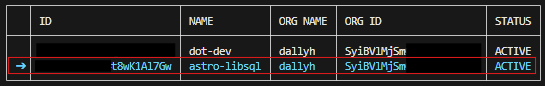
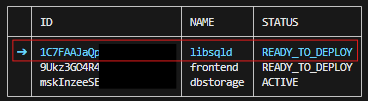
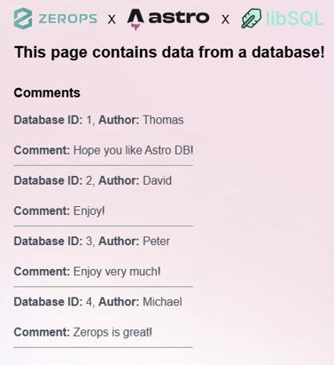

Deploying persistent database using [libsql-server](https://github.com/tursodatabase/libsql/blob/main/libsql-server/README.md) together with an [Astro](https://astro.build) project that uses [@astrojs/db](https://docs.astro.build/en/guides/astro-db/) on [Zerops](https://zerops.io) is quite easy.

:::tip
Zerops is a developer first cloud platform with easy to use and fully managed infrastructure for your projects. You can find more at [zerops.io](https://zerops.io).
:::

:::note
This article supposes that you're already familiar with [@astrojs/db](https://docs.astro.build/en/guides/astro-db/), Astro itself and Zerops. If you're not, go ahead and take a look at it, you won't regret it (I promise)! Before you start, you should have an Astro project ready with Astro DB integration installed and set up.
:::

Having a functional project on Zerops requires 3 services:

1. A nodejs service for the Astro frontend
2. An object-storage service to persist the database
3. An ubuntu based service to run libsql-server

In this article we will heavilly use a command line utility called [zcli](https://docs.zerops.io/references/cli) to create all of the mentioned Zerops services and a Zerops project. If you don't have it, go ahead and setup it according to the [docs](https://docs.zerops.io/references/cli).

First of all we need to create a Zerops project and all of the required services. For this we can either create a Zerops project and all of the services manually, or we can use a predefined YAML file and import it with zcli.
For this we will use a file named `zerops-project-import.yml` in root of an Astro project with the following structure.

```yaml
<!-- zerops-project-import.yml -->
project:
    name: astro-libsql
    corePackage: LIGHT
services:
    # libsqld service for libsql-server
    - hostname: libsqld
      type: ubuntu@24.04
      verticalAutoscaling:
          cpu: 1
          cpuMode: SHARED
          minRam: 0.25
          maxRam: 1
          minDisk: 1
          maxDisk: 5
      minContainers: 1
      maxContainers: 1
    # frontend service for Astro project
    - hostname: frontend
      type: nodejs@22
      verticalAutoscaling:
          cpu: 1
          cpuMode: SHARED
          minRam: 0.25
          maxRam: 1
          minDisk: 1
          maxDisk: 5
      minContainers: 1
      maxContainers: 1
    # dbstorage service to persist the database
    - hostname: dbstorage
      type: object-storage
      objectStorageSize: 2
```

This file ensures that all of the services are properly set up for this setup to work. You can see a project section (to create a new Zerops project) and also a services section to create all of the mentioned services. Description of this file can be found [here](https://docs.zerops.io/references/import).

After the file is created, we can use `zcli` to import the project into Zerops. This can be done by running `zcli project project-import .\zerops-project-import.yml` command in the root of an Astro project.

The output of the command should look like this:

```
➤  INFO  Import yaml found: C:\Repos\astro-libsql-zerops-example\zerops-project-import.yml
➤  INFO  Yaml file was checked
➤  INFO  Number of services to be added: 3
➤  INFO  Queued processes: 3
➤  INFO  Core services activation started
✔  DONE  dbstorage: stack.create
✔  DONE  frontend: stack.create
✔  DONE  libsqld: stack.create
➤  INFO  project imported
```

After the import is done, the next step is to actualy populate the `libsqld` and `frontend` services, push the database schema and deploy the Astro project itself. The service called `dbstorage` does not need any more special steps, because it is just a plain object storage.

For this, we have to use a file named `zerops.yml`. This file dictates how our services should be built and run.

```yml
<!-- zerops.yml -->
zerops:
    # libsqld service for libsql-server
    - setup: libsqld
      run:
          base: ubuntu@24.04
          envVariables:
              LIBSQL_BOTTOMLESS_ENDPOINT: ${dbstorage_apiUrl}
              LIBSQL_BOTTOMLESS_BUCKET: ${dbstorage_bucketName}
              LIBSQL_BOTTOMLESS_AWS_DEFAULT_REGION: eu-central-1
              LIBSQL_BOTTOMLESS_AWS_ACCESS_KEY_ID: ${dbstorage_accessKeyId}
              LIBSQL_BOTTOMLESS_AWS_SECRET_ACCESS_KEY: ${dbstorage_secretAccessKey}
          prepareCommands:
              - curl --proto '=https' --tlsv1.2 -LsSf https://github.com/tursodatabase/libsql/releases/download/libsql-server-v0.24.31/libsql-server-installer.sh | sh
              - mv /root/.cargo/bin/sqld /usr/local/bin/sqld
          start: sqld --enable-bottomless-replication --http-listen-addr 0.0.0.0:8080
          ports:
              - port: 8080
                httpSupport: true
    # frontend service for Astro project
    - setup: frontend
      build:
          base: nodejs@22
          envVariables:
              ASTRO_DB_REMOTE_URL: ${RUNTIME_ASTRO_DB_REMOTE_URL}
          buildCommands:
              - npm install
              - npm run build:remote
          cache:
              - node_modules
          deployFiles:
              - dist
              - node_modules
              - package.json
      run:
          base: nodejs@22
          ports:
              - port: 4321
                httpSupport: true
          envVariables:
              HOST: 0.0.0.0
              ASTRO_DB_REMOTE_URL: http://libsqld:8080
          start: npm run start
```

We will start with the database. For this we will again use `zcli` to push the `libsqld` service. This will install the `libsql-server` utilizing the `libsql-server` installer. Run `zcli push`, choose the newly created project `astro-libsql` and then the `libsqld` service.





Again, the output of the command should look like this:

```
➤  INFO  Selected project: astro-libsql
➤  INFO  Selected service: libsqld
➤  INFO  creating package
➤  INFO  File zerops.yml found. Path: C:\Repos\astro-libsql-zerops-example\zerops.yml.
✔  DONE  package uploaded
➤  INFO  package created
➤  INFO  deploying service
✔  DONE  Push finished
```

After the service push is done, we need to push the database schema. For this we need to connect to the [VPN](https://docs.zerops.io/references/vpn) provided by Zerops, so we can access the database server. You can connect to the VPN using `zcli vpn up`.

:::note
You have to have [Wireguard](https://www.wireguard.com/) installed for the VPN connection to be estabilished.
:::

Run the command `zcli vpn up` and select the project `astro-libsql`.

```
➤  INFO  Selected project: astro-libsql
➤  INFO  VPN private key created
➤  INFO  VPN config saved: C:\Users\user\AppData\Roaming\Zerops\zerops.conf
✔  DONE  VPN connected
```

You should now be able to push the database schema using Astro DB's [`push`](https://docs.astro.build/en/guides/astro-db/#pushing-table-schemas) command. This utilizes the `ASTRO_DB_REMOTE_URL` environment variable, which should be set to the internal URL of the `libsqld` Zerops service. In this case it is `http://libsqld:8080`.

Run `npx astro db push --remote` to push the database schema to the remote server.

```
Database schema is out of date.
Pushing database schema updates...
Push complete!
```

After the push is done, we can finally deploy Astro to our `frontend` service. Again, run `zcli push`, choose the newly created project `astro-libsql` and then the `frontend` service.

```
➤  INFO  Selected project: astro-libsql
➤  INFO  Selected service: frontend
➤  INFO  creating package
➤  INFO  File zerops.yml found. Path: C:\Repos\astro-libsql-zerops-example\zerops.yml.
✔  DONE  package uploaded
➤  INFO  package created
➤  INFO  deploying service
✔  DONE  Push finished
```

With the VPN up and running you should be able to access the deployed site under `http://frontend:4321/`, however we still need to push some data to the database. This can be done by the `npx astro db execute ./db/seed.ts --remote` command. This seeds the database with some data. Refresh the page, and you should see that something changed!



Dont forget to turn off the VPN with `zcli vpn down`!.

Example repository with code used in this article can be found on GitHub [astro-libsql-zerops-example](https://github.com/dallyh/astro-libsql-zerops-example).
